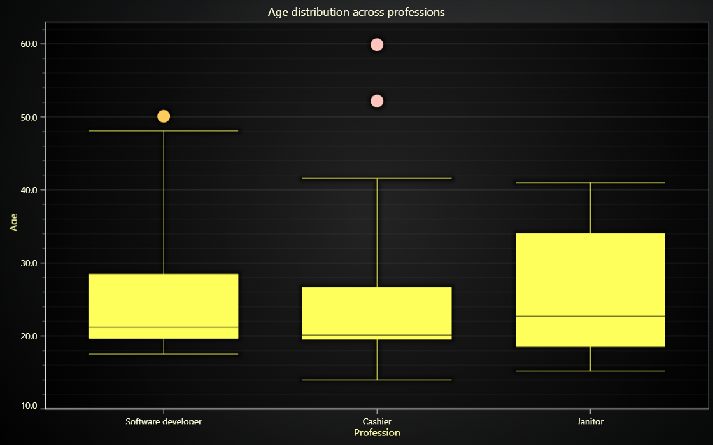

# JavaScript Box and Whiskers Chart

This demo application belongs to the set of examples for LightningChart JS, data visualization library for JavaScript.

LightningChart JS is entirely GPU accelerated and performance optimized charting library for presenting massive amounts of data. It offers an easy way of creating sophisticated and interactive charts and adding them to your website or web application.

The demo can be used as an example or a seed project. Local execution requires the following steps:

-   Make sure that relevant version of [Node.js](https://nodejs.org/en/download/) is installed
-   Open the project folder in a terminal:

          npm install              # fetches dependencies
          npm start                # builds an application and starts the development server

-   The application is available at _http://localhost:8080_ in your browser, webpack-dev-server provides hot reload functionality.

## Description

Example creates a traditional _Box and Whiskers Chart_ using _ChartXY_, _BoxSeries_ and _PointSeries_ for outliers.

_Box and Whiskers Chart_ provides a compact way of visually displaying distribution of data through _quartiles_.

## Anatomy

The lines extending parallel from the boxes are known as the "whiskers", which are used to indicate variability outside the upper and lower quartiles.

_Outliers_ are sometimes drawn as individual dots that are in-line with the whiskers.

[//]: # 'IMPORTANT: The assets will not show before README.md is built - relative path is different!'

Here are the types of observations one can make from viewing a _Box And Whiskers Chart_:

-   What the key values are, such as: average, median, 25th percentile etc.
-   If there are any _outliers_ and what their values are.
-   Is the data symmetrical.
-   How tightly is the data grouped.
-   If the data is skewed and if so, in what direction.

## API Links

* [XY cartesian chart]
* [Axis tick strategies]
* [AutoCursor modes]
* [Point shapes]
* [HEX Color factory]
* [Solid Fill style]
* [Solid Line style]
* [Empty Axis tick style]
* [Empty Fill style]
* [Empty Line style]

## Support

If you notice an error in the example code, please open an issue on [GitHub][0] repository of the entire example.

Official [API documentation][1] can be found on [LightningChart][2] website.

If the docs and other materials do not solve your problem as well as implementation help is needed, ask on [StackOverflow][3] (tagged lightningchart).

If you think you found a bug in the LightningChart JavaScript library, please contact support@lightningchart.com.

Direct developer email support can be purchased through a [Support Plan][4] or by contacting sales@lightningchart.com.

[0]: https://github.com/Arction/
[1]: https://lightningchart.com/lightningchart-js-api-documentation/
[2]: https://lightningchart.com
[3]: https://stackoverflow.com/questions/tagged/lightningchart
[4]: https://lightningchart.com/support-services/

© LightningChart Ltd 2009-2022. All rights reserved.

[XY cartesian chart]: https://lightningchart.com/lightningchart-js-api-documentation/v4.1.0/classes/ChartXY.html
[Axis tick strategies]: https://lightningchart.com/lightningchart-js-api-documentation/v4.1.0/variables/AxisTickStrategies.html
[AutoCursor modes]: https://lightningchart.com/lightningchart-js-api-documentation/v4.1.0/enums/AutoCursorModes.html
[Point shapes]: https://lightningchart.com/lightningchart-js-api-documentation/v4.1.0/enums/PointShape.html
[HEX Color factory]: https://lightningchart.com/lightningchart-js-api-documentation/v4.1.0/functions/ColorHEX.html
[Solid Fill style]: https://lightningchart.com/lightningchart-js-api-documentation/v4.1.0/classes/SolidFill.html
[Solid Line style]: https://lightningchart.com/lightningchart-js-api-documentation/v4.1.0/classes/SolidLine.html
[Empty Axis tick style]: https://lightningchart.com/lightningchart-js-api-documentation/v4.1.0/variables/emptyTick.html
[Empty Fill style]: https://lightningchart.com/lightningchart-js-api-documentation/v4.1.0/variables/emptyFill-1.html
[Empty Line style]: https://lightningchart.com/lightningchart-js-api-documentation/v4.1.0/variables/emptyLine.html

